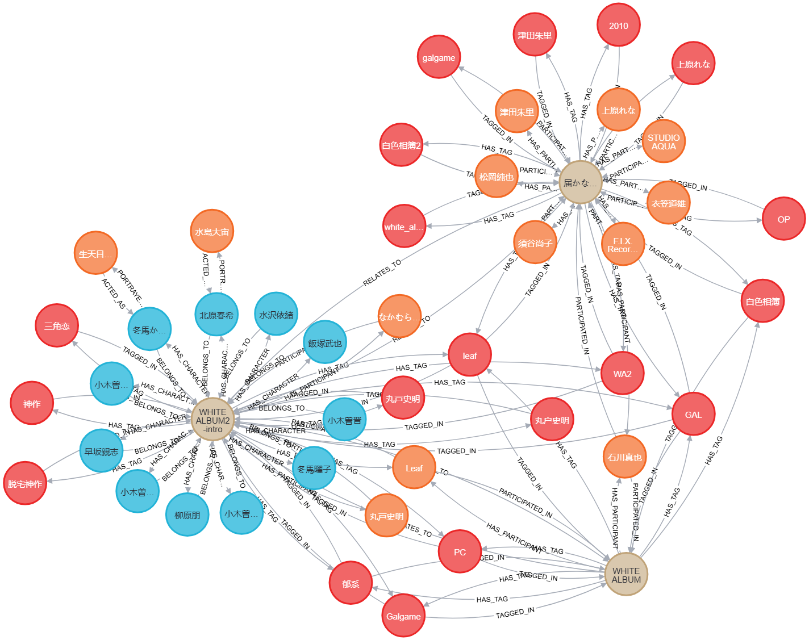

## Bangumi-KGQA

本项目使用 **bangumi** 番组计划的存档静态数据作为数据来源，**neo4j** 图数据库作为存储方式，最终实现基于知识图谱的问答系统，即 **KGQA** 或称 **KBQA** 。


~~由于本身作为课程大作业，需要赶时间~~，QA 部分的实现很 simple，后续还有热情的话，会更新 KG-Embedding 的方式。（大概）

可以参照本仓库的知识图谱构建方式，不再需要从零开始构建 **Bangumi** 知识图谱是本人的本愿。


关于 **jsonlines** 的键值含义、结构，见数据来源：[`bangumi/Archive`](https://github.com/bangumi/Archive) 。

常量对应关系见 [`bangumi/common`](https://github.com/bangumi/common) 。


原数据中 **subject** 约有 500k 条，**person** 约有 70k 条，**character** 约 170k 条，**episode** 约 1370k 条。

因 **neo4j** 的**线上版本**免费额度对节点和关系的限制（节点 200k，关系 400k，若使用本地社区版则不需要关注，可以直接使用 **raw_data** 或者改大条数）与构建时间较长的原因，为了项目 demo 的顺利运行，对数据进行了阉割，但不影响基本的知识图谱的构建。


## 仓库结构说明

```sh
│  .gitignore
│  const.py                              # 常量
│  data_reduce.py                        # 生成部分数据
│  image.png
│  jsonl2neo4j.py                        # 数据导入图数据库 neo4j
│  README.md
│  request.jpg
│  wiki_parser.mjs                       # wiki-parse js调用
│  wiki_parser.py                        # wiki-parse py调用
│
├─data
│  │  subject_platforms.yml              # 常量对应关系
│  │  subject_relations.yml              # 常量对应关系
│  │  subject_staffs.yml                 # 常量对应关系
│  │                             
│  ├─raw_data                            # Archive 数据
│  └─reduced_data                        # raw_data 的部分数据，放出来的是前十条go
│
├─KG_neo4j                               # 10、5k条构建的知识图谱 csv 导出文件
│  │
|  ├─bangumi_neo4j_10
│  └─bangumi_neo4j_5k
│
└─QA                                     # 问答系统
```


## 知识图谱/图数据库设计

为了保证 neo4j 免费额度的可用性，只取和前 5k 条 **subject** 相关的 **person** , **character** , **tag** 作为实体，实际上抛弃了 **episode** 。

下面是增加条件限制后的数量：

```yaml
Entity:
- subject         # 5000
  - subject_id
  - type
  - name    # 中文名 name_cn
  - name_cn
  - platform # type + *
  - infobox # type_cn
  - summary # 简介
  - date
  - score
  - rank
- person          # 13336
  - person_id
  - name
  - career
  - infobox # 简体中文名 name_cn
  - summary # 简介
- character       # 23205
  - character_id
  - name
  - role
  - infobox # 简体中文名
  - summary # 简介
- tag                # 10566
  - name

Relations:
- subject-subject    # 6028
  - RELATES_TO
- subject-character  # 33012 x 2
  - BELONGS_TO
  - HAS_CHARACTER
- subject-person     # 92771 x 2
  - PARTICIPATED_IN
  - HAS_PARTICIPANT
- person-character   # 8818
  - ACTED_AS
  - PORTRAYED_BY
- subject-tag        # 43912
  - HAS_TAG
  - TAGGED_IN
# Node size: 52107
# Relation size: 184541 -> 326110
```

由于关系会建双向边，为了不让关系超出额度，选用前 5k **subject** 比较合适。

同时，由于时间有点有限，对 **infobox** 和 **summary** 的利用都有限，未来若有想接着往后推进的可以考虑对这两者的优化，**summary** 做特征词提取，增加 **career** 实体之类的；这里对 **infobox** 主要是对没有 **name_cn** 实体，进行补充中文名。

## 效果演示


